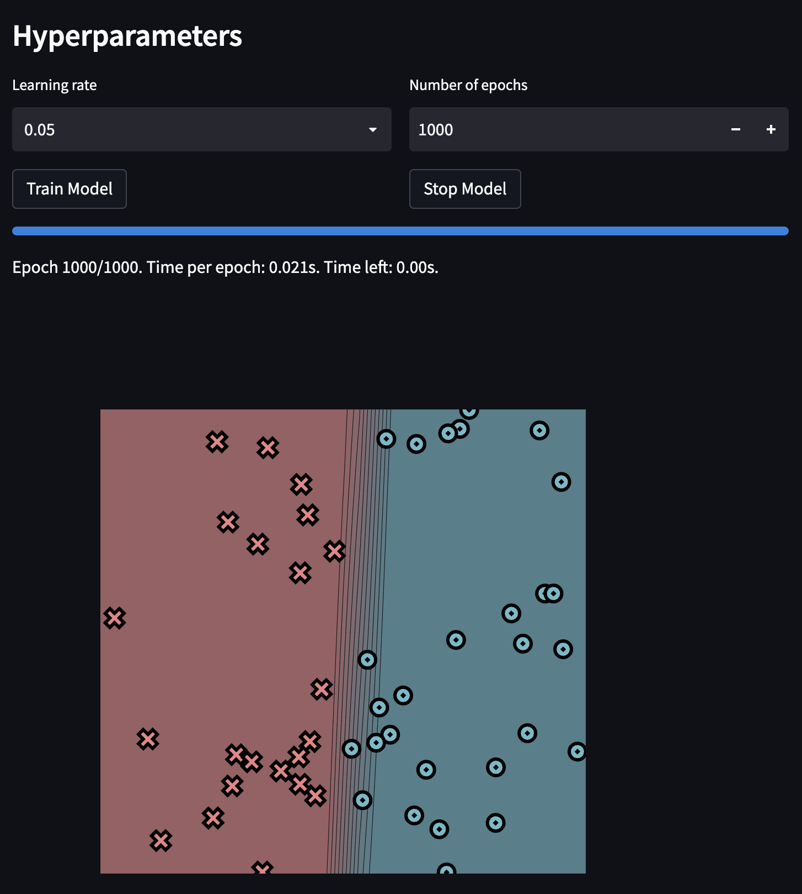
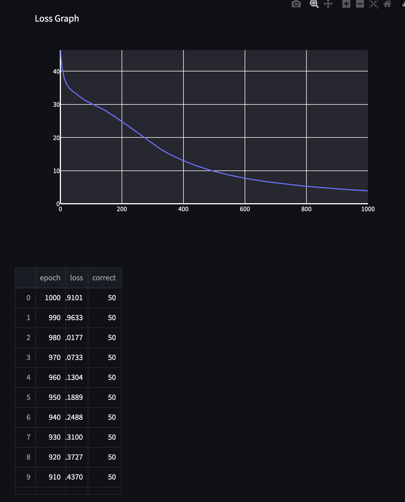
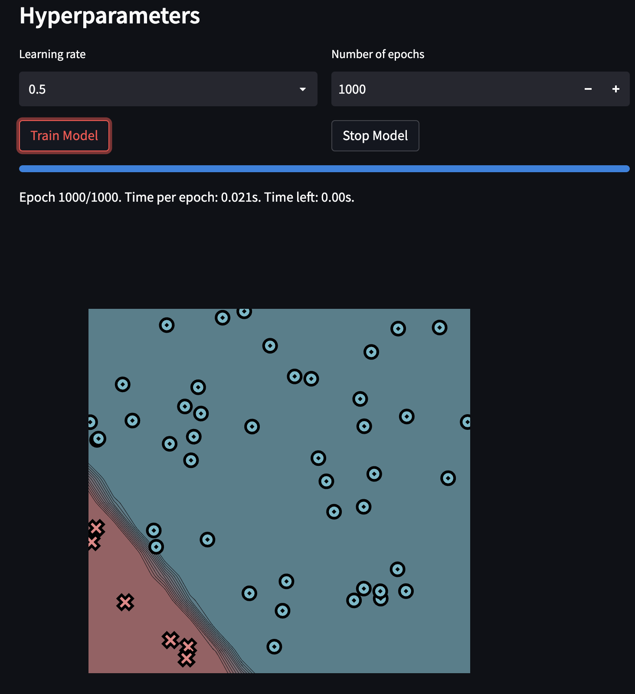
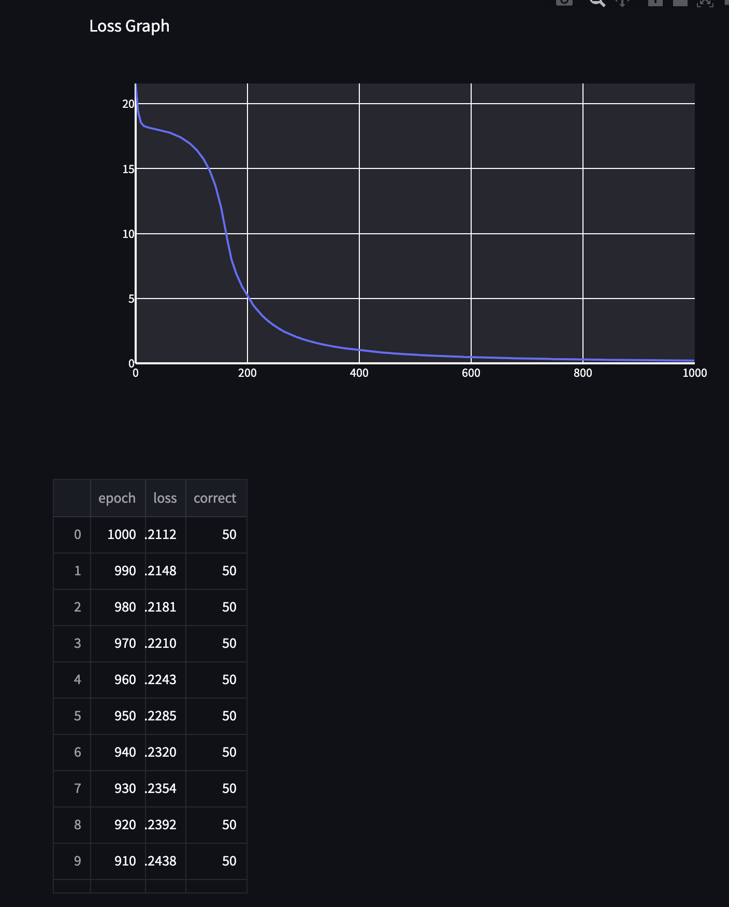
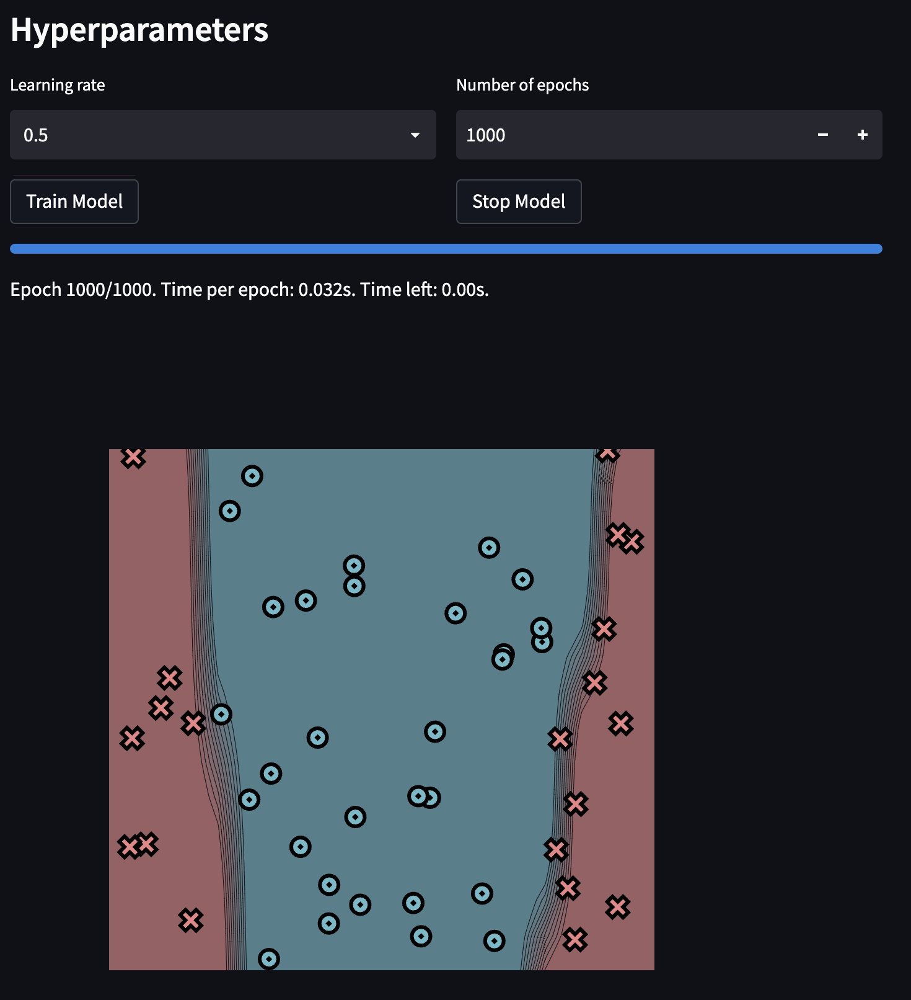
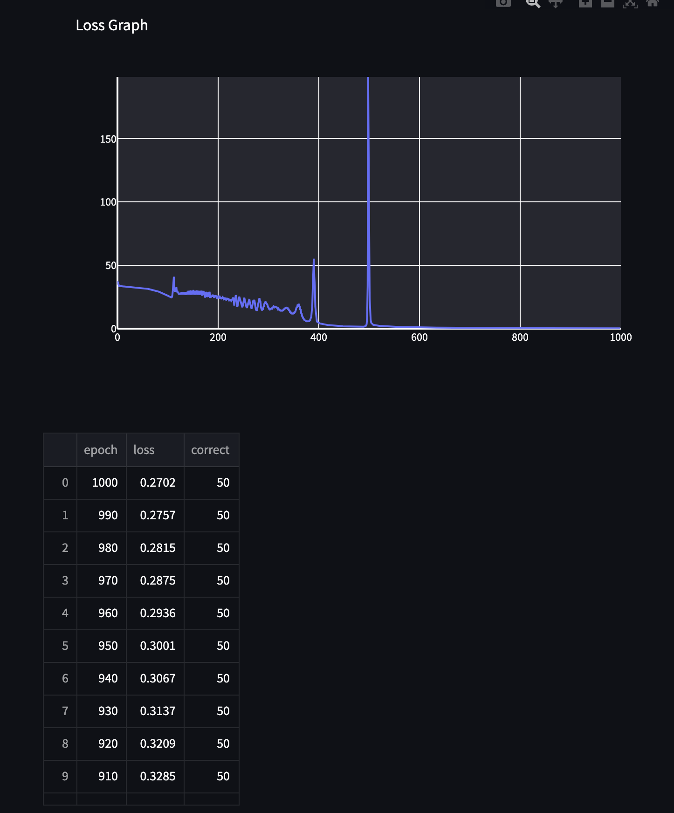
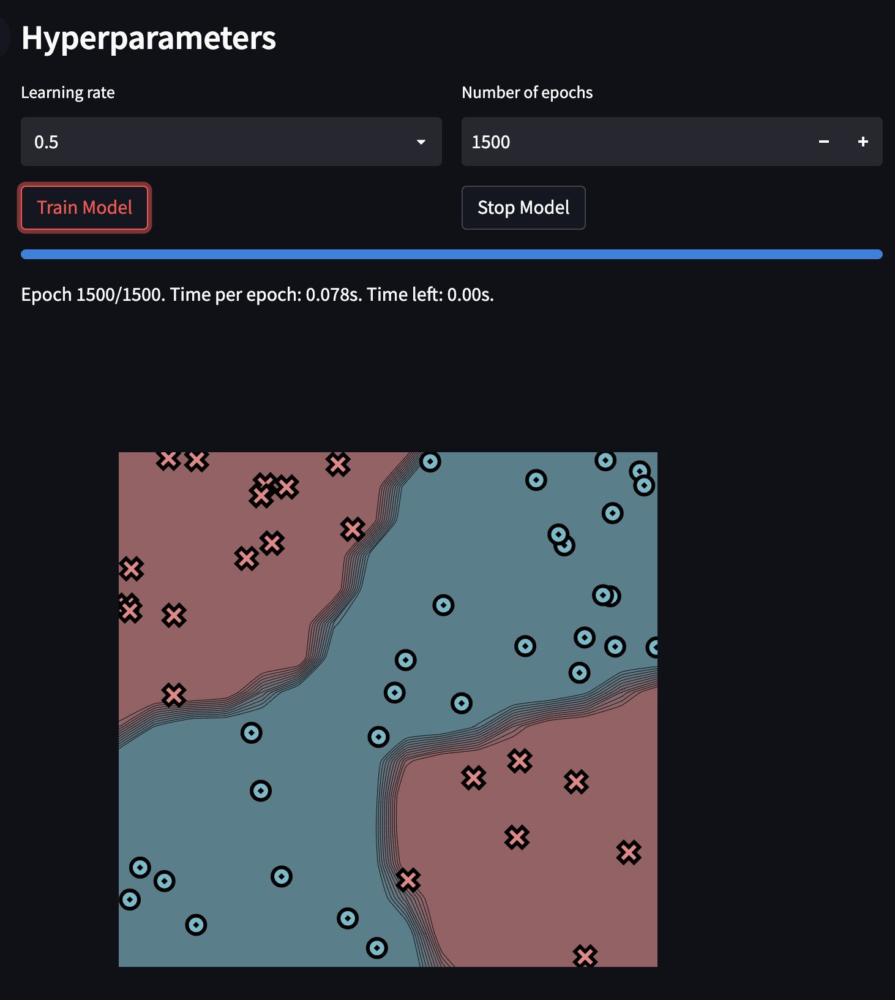
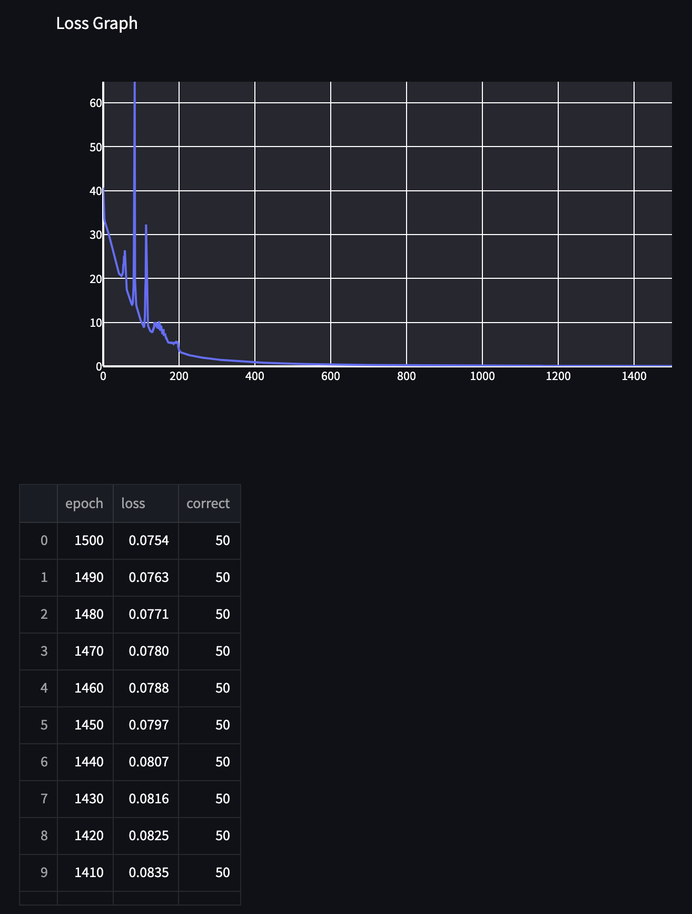

[](https://classroom.github.com/a/YFgwt0yY)
# MiniTorch Module 2


* Docs: https://minitorch.github.io/

* Overview: https://minitorch.github.io/module2/module2/

This assignment requires the following files from the previous assignments. You can get these by running

```bash
python sync_previous_module.py previous-module-dir current-module-dir
```

The files that will be synced are:

        minitorch/operators.py minitorch/module.py minitorch/autodiff.py minitorch/scalar.py minitorch/scalar_functions.py minitorch/module.py project/run_manual.py project/run_scalar.py project/datasets.py

Simple Dataset:
- 50 data points, 2 hidden layers
- Time per epoch: 0.021s



Traning Log:
Epoch: 0/1000, loss: 0, correct: 0
Epoch: 10/1000, loss: 39.3710553301398, correct: 28
Epoch: 20/1000, loss: 36.301812878126086, correct: 28
Epoch: 30/1000, loss: 34.892443279984576, correct: 28
Epoch: 40/1000, loss: 34.0362401406841, correct: 28
Epoch: 50/1000, loss: 33.35693831200324, correct: 28
Epoch: 60/1000, loss: 32.562296164942516, correct: 28
Epoch: 70/1000, loss: 31.82131074763377, correct: 28
Epoch: 80/1000, loss: 31.259780299202642, correct: 28
Epoch: 90/1000, loss: 30.83596272038985, correct: 28
Epoch: 100/1000, loss: 30.404139914412948, correct: 28
Epoch: 110/1000, loss: 29.962152421544246, correct: 28
Epoch: 120/1000, loss: 29.49659607871876, correct: 28
Epoch: 130/1000, loss: 29.00687517239344, correct: 28
Epoch: 140/1000, loss: 28.492394431855647, correct: 28
Epoch: 150/1000, loss: 27.953205310814095, correct: 28
Epoch: 160/1000, loss: 27.389876630214196, correct: 28
Epoch: 170/1000, loss: 26.800178108493242, correct: 36
Epoch: 180/1000, loss: 26.183062786231297, correct: 36
Epoch: 190/1000, loss: 25.552028135207564, correct: 36
Epoch: 200/1000, loss: 24.90734666176839, correct: 37
Epoch: 210/1000, loss: 24.247608474613735, correct: 39
Epoch: 220/1000, loss: 23.57611885360712, correct: 39
Epoch: 230/1000, loss: 22.894539234004, correct: 40
Epoch: 240/1000, loss: 22.209071089538003, correct: 40
Epoch: 250/1000, loss: 21.5296464253527, correct: 40
Epoch: 260/1000, loss: 20.846714392283776, correct: 43
Epoch: 270/1000, loss: 20.168273470303262, correct: 43
Epoch: 280/1000, loss: 19.490141002946466, correct: 43
Epoch: 290/1000, loss: 18.8142215293682, correct: 45
Epoch: 300/1000, loss: 18.14624069928821, correct: 47
Epoch: 310/1000, loss: 17.506171114951552, correct: 48
Epoch: 320/1000, loss: 16.88943642850675, correct: 48
Epoch: 330/1000, loss: 16.30056437266922, correct: 48
Epoch: 340/1000, loss: 15.758623491218938, correct: 48
Epoch: 350/1000, loss: 15.251185095248259, correct: 48
Epoch: 360/1000, loss: 14.77230267853908, correct: 49
Epoch: 370/1000, loss: 14.31018387760845, correct: 49
Epoch: 380/1000, loss: 13.865104414343572, correct: 49
Epoch: 390/1000, loss: 13.442161570332807, correct: 49
Epoch: 400/1000, loss: 13.039357057507987, correct: 49
Epoch: 410/1000, loss: 12.653004003330382, correct: 50
Epoch: 420/1000, loss: 12.281801711539625, correct: 50
Epoch: 430/1000, loss: 11.924710889864386, correct: 50
Epoch: 440/1000, loss: 11.581356705656736, correct: 50
Epoch: 450/1000, loss: 11.251326163472267, correct: 50
Epoch: 460/1000, loss: 10.935030951780677, correct: 50
Epoch: 470/1000, loss: 10.631202466551208, correct: 50
Epoch: 480/1000, loss: 10.34054036191789, correct: 50
Epoch: 490/1000, loss: 10.06228180979353, correct: 50
Epoch: 500/1000, loss: 9.798406900000314, correct: 50
Epoch: 510/1000, loss: 9.54769747137156, correct: 50
Epoch: 520/1000, loss: 9.306908016896575, correct: 50
Epoch: 530/1000, loss: 9.076634291028444, correct: 50
Epoch: 540/1000, loss: 8.858639292768828, correct: 50
Epoch: 550/1000, loss: 8.650582108548202, correct: 50
Epoch: 560/1000, loss: 8.450580891310654, correct: 50
Epoch: 570/1000, loss: 8.259119559252163, correct: 50
Epoch: 580/1000, loss: 8.074508445792572, correct: 50
Epoch: 590/1000, loss: 7.8961558167091646, correct: 50
Epoch: 600/1000, loss: 7.723787315651095, correct: 50
Epoch: 610/1000, loss: 7.557143767527214, correct: 50
Epoch: 620/1000, loss: 7.3959794655279225, correct: 50
Epoch: 630/1000, loss: 7.240061396576838, correct: 50
Epoch: 640/1000, loss: 7.0900351926681395, correct: 50
Epoch: 650/1000, loss: 6.9458453048444575, correct: 50
Epoch: 660/1000, loss: 6.807210525770145, correct: 50
Epoch: 670/1000, loss: 6.674068493588578, correct: 50
Epoch: 680/1000, loss: 6.545639931577624, correct: 50
Epoch: 690/1000, loss: 6.421191235434966, correct: 50
Epoch: 700/1000, loss: 6.300510672797965, correct: 50
Epoch: 710/1000, loss: 6.183433326401723, correct: 50
Epoch: 720/1000, loss: 6.069804718655782, correct: 50
Epoch: 730/1000, loss: 5.9594798044540696, correct: 50
Epoch: 740/1000, loss: 5.852322207939181, correct: 50
Epoch: 750/1000, loss: 5.74820352925092, correct: 50
Epoch: 760/1000, loss: 5.64700271573015, correct: 50
Epoch: 770/1000, loss: 5.548605491699419, correct: 50
Epoch: 780/1000, loss: 5.452903841307602, correct: 50
Epoch: 790/1000, loss: 5.359795539346583, correct: 50
Epoch: 800/1000, loss: 5.269422089313927, correct: 50
Epoch: 810/1000, loss: 5.1822415728074205, correct: 50
Epoch: 820/1000, loss: 5.09763353778389, correct: 50
Epoch: 830/1000, loss: 5.015544994690348, correct: 50
Epoch: 840/1000, loss: 4.93576190784418, correct: 50
Epoch: 850/1000, loss: 4.858482333683197, correct: 50
Epoch: 860/1000, loss: 4.783486007089175, correct: 50
Epoch: 870/1000, loss: 4.710558297573024, correct: 50
Epoch: 880/1000, loss: 4.639528000576148, correct: 50
Epoch: 890/1000, loss: 4.570314538418562, correct: 50
Epoch: 900/1000, loss: 4.5028199035584535, correct: 50
Epoch: 910/1000, loss: 4.436990344845716, correct: 50
Epoch: 920/1000, loss: 4.372738179787416, correct: 50
Epoch: 930/1000, loss: 4.310020942124583, correct: 50
Epoch: 940/1000, loss: 4.248756698402405, correct: 50
Epoch: 950/1000, loss: 4.188913231113141, correct: 50
Epoch: 960/1000, loss: 4.130418435355252, correct: 50
Epoch: 970/1000, loss: 4.0733011040233125, correct: 50
Epoch: 980/1000, loss: 4.017650929856386, correct: 50
Epoch: 990/1000, loss: 3.963313562877957, correct: 50
Epoch: 1000/1000, loss: 3.910142950530428, correct: 50

Diag Dataset:
- 50 data points, 2 hidden layers
- Time per epoch: 0.021s.



Training Log:
Epoch: 0/1000, loss: 0, correct: 0
Epoch: 10/1000, loss: 18.603842177221406, correct: 44
Epoch: 20/1000, loss: 18.203318767941067, correct: 44
Epoch: 30/1000, loss: 18.109959849559615, correct: 44
Epoch: 40/1000, loss: 18.02395551700803, correct: 44
Epoch: 50/1000, loss: 17.921629910895383, correct: 44
Epoch: 60/1000, loss: 17.79560721321467, correct: 44
Epoch: 70/1000, loss: 17.63792563551021, correct: 44
Epoch: 80/1000, loss: 17.43869135440644, correct: 44
Epoch: 90/1000, loss: 17.185172915570657, correct: 44
Epoch: 100/1000, loss: 16.860370191458095, correct: 44
Epoch: 110/1000, loss: 16.440468153343037, correct: 44
Epoch: 120/1000, loss: 15.890079386057062, correct: 44
Epoch: 130/1000, loss: 15.153245523255153, correct: 44
Epoch: 140/1000, loss: 14.137597484586502, correct: 44
Epoch: 150/1000, loss: 12.69770197705686, correct: 44
Epoch: 160/1000, loss: 10.689833509071992, correct: 44
Epoch: 170/1000, loss: 8.41321284198138, correct: 44
Epoch: 180/1000, loss: 7.044539905332813, correct: 48
Epoch: 190/1000, loss: 6.0308654683569065, correct: 48
Epoch: 200/1000, loss: 5.237724025623454, correct: 48
Epoch: 210/1000, loss: 4.557599150066083, correct: 49
Epoch: 220/1000, loss: 3.9957511306134577, correct: 49
Epoch: 230/1000, loss: 3.579457623009039, correct: 49
Epoch: 240/1000, loss: 3.2029064581934046, correct: 50
Epoch: 250/1000, loss: 2.8764721154931556, correct: 50
Epoch: 260/1000, loss: 2.596202692274468, correct: 50
Epoch: 270/1000, loss: 2.368305908189945, correct: 50
Epoch: 280/1000, loss: 2.1704953914396152, correct: 50
Epoch: 290/1000, loss: 2.013486340385508, correct: 50
Epoch: 300/1000, loss: 1.8660450330788576, correct: 50
Epoch: 310/1000, loss: 1.7349228890883117, correct: 50
Epoch: 320/1000, loss: 1.6180422085985533, correct: 50
Epoch: 330/1000, loss: 1.5134145806807071, correct: 50
Epoch: 340/1000, loss: 1.4193832900593588, correct: 50
Epoch: 350/1000, loss: 1.3345592597008753, correct: 50
Epoch: 360/1000, loss: 1.257771152053089, correct: 50
Epoch: 370/1000, loss: 1.18802608565958, correct: 50
Epoch: 380/1000, loss: 1.124478398911015, correct: 50
Epoch: 390/1000, loss: 1.0664045903961816, correct: 50
Epoch: 400/1000, loss: 1.0131830570338423, correct: 50
Epoch: 410/1000, loss: 0.9642775996851163, correct: 50
Epoch: 420/1000, loss: 0.9192239156291022, correct: 50
Epoch: 430/1000, loss: 0.8776184786592832, correct: 50
Epoch: 440/1000, loss: 0.8391093413414433, correct: 50
Epoch: 450/1000, loss: 0.8065176732535572, correct: 50
Epoch: 460/1000, loss: 0.7712233893137839, correct: 50
Epoch: 470/1000, loss: 0.7434341536237006, correct: 50
Epoch: 480/1000, loss: 0.7114129136805165, correct: 50
Epoch: 490/1000, loss: 0.6873203400124025, correct: 50
Epoch: 500/1000, loss: 0.6625785262932171, correct: 50
Epoch: 510/1000, loss: 0.6361381145130857, correct: 50
Epoch: 520/1000, loss: 0.614561626132216, correct: 50
Epoch: 530/1000, loss: 0.5960320472702126, correct: 50
Epoch: 540/1000, loss: 0.5755701557975048, correct: 50
Epoch: 550/1000, loss: 0.5552220563299812, correct: 50
Epoch: 560/1000, loss: 0.5381873201993405, correct: 50
Epoch: 570/1000, loss: 0.5236161878904203, correct: 50
Epoch: 580/1000, loss: 0.5076911069646703, correct: 50
Epoch: 590/1000, loss: 0.4922325618519511, correct: 50
Epoch: 600/1000, loss: 0.47674158296972674, correct: 50
Epoch: 610/1000, loss: 0.46327741378738685, correct: 50
Epoch: 620/1000, loss: 0.4508773877114536, correct: 50
Epoch: 630/1000, loss: 0.43879598821018234, correct: 50
Epoch: 640/1000, loss: 0.4283478844200892, correct: 50
Epoch: 650/1000, loss: 0.4173740331649798, correct: 50
Epoch: 660/1000, loss: 0.40682126873502167, correct: 50
Epoch: 670/1000, loss: 0.3967315895535835, correct: 50
Epoch: 680/1000, loss: 0.3870772943571612, correct: 50
Epoch: 690/1000, loss: 0.37783253747597023, correct: 50
Epoch: 700/1000, loss: 0.36897339255268924, correct: 50
Epoch: 710/1000, loss: 0.3604776835537386, correct: 50
Epoch: 720/1000, loss: 0.3523248322363699, correct: 50
Epoch: 730/1000, loss: 0.3444957210083047, correct: 50
Epoch: 740/1000, loss: 0.33697256941097714, correct: 50
Epoch: 750/1000, loss: 0.32973882268479593, correct: 50
Epoch: 760/1000, loss: 0.3227790510720467, correct: 50
Epoch: 770/1000, loss: 0.3160788586819, correct: 50
Epoch: 780/1000, loss: 0.3096248008868815, correct: 50
Epoch: 790/1000, loss: 0.30340430934503854, correct: 50
Epoch: 800/1000, loss: 0.29740562384996433, correct: 50
Epoch: 810/1000, loss: 0.2916177303043974, correct: 50
Epoch: 820/1000, loss: 0.2860303041944378, correct: 50
Epoch: 830/1000, loss: 0.28000689607223644, correct: 50
Epoch: 840/1000, loss: 0.2749545356514415, correct: 50
Epoch: 850/1000, loss: 0.2704436524899061, correct: 50
Epoch: 860/1000, loss: 0.26569807194421213, correct: 50
Epoch: 870/1000, loss: 0.26116643336104267, correct: 50
Epoch: 880/1000, loss: 0.2558996975898156, correct: 50
Epoch: 890/1000, loss: 0.2515613997624804, correct: 50
Epoch: 900/1000, loss: 0.24780276079075797, correct: 50
Epoch: 910/1000, loss: 0.24384830258951096, correct: 50
Epoch: 920/1000, loss: 0.23917384754635232, correct: 50
Epoch: 930/1000, loss: 0.2353584381656795, correct: 50
Epoch: 940/1000, loss: 0.23204331003247672, correct: 50
Epoch: 950/1000, loss: 0.22850972336065375, correct: 50
Epoch: 960/1000, loss: 0.22433861703155664, correct: 50
Epoch: 970/1000, loss: 0.2210079211718935, correct: 50
Epoch: 980/1000, loss: 0.2180639883399192, correct: 50
Epoch: 990/1000, loss: 0.21484418513258705, correct: 50
Epoch: 1000/1000, loss: 0.21116154044774324, correct: 50

Split Dataset:
- 50 data points, 3 hidden layers
- Time per epoch: 0.032s.



Training Log:
Epoch: 0/1000, loss: 0, correct: 0
Epoch: 10/1000, loss: 33.382741675411644, correct: 30
Epoch: 20/1000, loss: 33.130926572583554, correct: 30
Epoch: 30/1000, loss: 32.84506634577078, correct: 30
Epoch: 40/1000, loss: 32.49777948109972, correct: 30
Epoch: 50/1000, loss: 32.05414172169352, correct: 30
Epoch: 60/1000, loss: 31.467437659701858, correct: 33
Epoch: 70/1000, loss: 30.68443253084502, correct: 37
Epoch: 80/1000, loss: 29.574936837770487, correct: 41
Epoch: 90/1000, loss: 28.092521499356238, correct: 42
Epoch: 100/1000, loss: 26.186511755854337, correct: 42
Epoch: 110/1000, loss: 26.272306343101835, correct: 35
Epoch: 120/1000, loss: 29.794181978341765, correct: 30
Epoch: 130/1000, loss: 28.503587438909417, correct: 30
Epoch: 140/1000, loss: 29.07765733395719, correct: 31
Epoch: 150/1000, loss: 29.998984453014145, correct: 32
Epoch: 160/1000, loss: 29.965477791289775, correct: 34
Epoch: 170/1000, loss: 28.508392381276828, correct: 36
Epoch: 180/1000, loss: 26.442006298480322, correct: 36
Epoch: 190/1000, loss: 26.865670235186386, correct: 36
Epoch: 200/1000, loss: 24.37844406081729, correct: 36
Epoch: 210/1000, loss: 24.83377479192018, correct: 35
Epoch: 220/1000, loss: 23.57805880506909, correct: 35
Epoch: 230/1000, loss: 23.447519302996238, correct: 35
Epoch: 240/1000, loss: 18.593131263415035, correct: 39
Epoch: 250/1000, loss: 18.082339694695214, correct: 39
Epoch: 260/1000, loss: 19.054440243481608, correct: 39
Epoch: 270/1000, loss: 19.790574016881045, correct: 38
Epoch: 280/1000, loss: 17.810543182802583, correct: 39
Epoch: 290/1000, loss: 15.36704749485779, correct: 41
Epoch: 300/1000, loss: 17.13764680015736, correct: 39
Epoch: 310/1000, loss: 16.407948899120534, correct: 40
Epoch: 320/1000, loss: 15.37317077805791, correct: 40
Epoch: 330/1000, loss: 14.111289508290293, correct: 42
Epoch: 340/1000, loss: 15.051616181751168, correct: 41
Epoch: 350/1000, loss: 11.462423717160279, correct: 43
Epoch: 360/1000, loss: 17.825137866283104, correct: 38
Epoch: 370/1000, loss: 7.9640281086888995, correct: 47
Epoch: 380/1000, loss: 5.59758148606615, correct: 48
Epoch: 390/1000, loss: 39.300624136191786, correct: 32
Epoch: 400/1000, loss: 4.664109694355068, correct: 50
Epoch: 410/1000, loss: 3.4177138907552007, correct: 50
Epoch: 420/1000, loss: 2.7932404845125522, correct: 50
Epoch: 430/1000, loss: 2.3845931767232385, correct: 50
Epoch: 440/1000, loss: 2.08691572345189, correct: 50
Epoch: 450/1000, loss: 1.8606206864289676, correct: 50
Epoch: 460/1000, loss: 1.6859894465134888, correct: 50
Epoch: 470/1000, loss: 1.5555112090409189, correct: 50
Epoch: 480/1000, loss: 1.4757498848759802, correct: 50
Epoch: 490/1000, loss: 1.5464881979569627, correct: 50
Epoch: 500/1000, loss: 161.54618864665443, correct: 22
Epoch: 510/1000, loss: 2.935808824845657, correct: 50
Epoch: 520/1000, loss: 2.2701845436752546, correct: 50
Epoch: 530/1000, loss: 1.9315362902288569, correct: 50
Epoch: 540/1000, loss: 1.6938772132930926, correct: 50
Epoch: 550/1000, loss: 1.5148520240439427, correct: 50
Epoch: 560/1000, loss: 1.3736977508049162, correct: 50
Epoch: 570/1000, loss: 1.2587399375831336, correct: 50
Epoch: 580/1000, loss: 1.1628555015788082, correct: 50
Epoch: 590/1000, loss: 1.081373307156689, correct: 50
Epoch: 600/1000, loss: 1.0110806995798223, correct: 50
Epoch: 610/1000, loss: 0.9496857778696108, correct: 50
Epoch: 620/1000, loss: 0.895503983542128, correct: 50
Epoch: 630/1000, loss: 0.8472768899201651, correct: 50
Epoch: 640/1000, loss: 0.8040362931116216, correct: 50
Epoch: 650/1000, loss: 0.7650142520898409, correct: 50
Epoch: 660/1000, loss: 0.7295653204788595, correct: 50
Epoch: 670/1000, loss: 0.6971994608497978, correct: 50
Epoch: 680/1000, loss: 0.6675155374435822, correct: 50
Epoch: 690/1000, loss: 0.6401813702228532, correct: 50
Epoch: 700/1000, loss: 0.6149191746722673, correct: 50
Epoch: 710/1000, loss: 0.5914946105269531, correct: 50
Epoch: 720/1000, loss: 0.5697084209713237, correct: 50
Epoch: 730/1000, loss: 0.5493899639428844, correct: 50
Epoch: 740/1000, loss: 0.5303921471042251, correct: 50
Epoch: 750/1000, loss: 0.5125874187749525, correct: 50
Epoch: 760/1000, loss: 0.49586456332742324, correct: 50
Epoch: 770/1000, loss: 0.4801261165058971, correct: 50
Epoch: 780/1000, loss: 0.4652862634804162, correct: 50
Epoch: 790/1000, loss: 0.45126911642710515, correct: 50
Epoch: 800/1000, loss: 0.4380072931389694, correct: 50
Epoch: 810/1000, loss: 0.4254407363641374, correct: 50
Epoch: 820/1000, loss: 0.4135157271132349, correct: 50
Epoch: 830/1000, loss: 0.4021840553667075, correct: 50
Epoch: 840/1000, loss: 0.3914023193518463, correct: 50
Epoch: 850/1000, loss: 0.3811313304900058, correct: 50
Epoch: 860/1000, loss: 0.37133560569748575, correct: 50
Epoch: 870/1000, loss: 0.3619829322929058, correct: 50
Epoch: 880/1000, loss: 0.353043993564079, correct: 50
Epoch: 890/1000, loss: 0.34449204525954247, correct: 50
Epoch: 900/1000, loss: 0.3363026350285769, correct: 50
Epoch: 910/1000, loss: 0.32845335824060184, correct: 50
Epoch: 920/1000, loss: 0.32092364474687746, correct: 50
Epoch: 930/1000, loss: 0.31369457206334816, correct: 50
Epoch: 940/1000, loss: 0.30674870119836173, correct: 50
Epoch: 950/1000, loss: 0.300069931957802, correct: 50
Epoch: 960/1000, loss: 0.2936433750600859, correct: 50
Epoch: 970/1000, loss: 0.28745523880585394, correct: 50
Epoch: 980/1000, loss: 0.2814927283888205, correct: 50
Epoch: 990/1000, loss: 0.2757439562183987, correct: 50
Epoch: 1000/1000, loss: 0.2701978618619926, correct: 50

Xor Dataset:
- 50 data points, 6 hidden layers
- Time per epoch: 0.078s.



Training Log:
Epoch: 0/1500, loss: 0, correct: 0
Epoch: 10/1500, loss: 31.63222941471466, correct: 34
Epoch: 20/1500, loss: 28.512433652105027, correct: 42
Epoch: 30/1500, loss: 24.84384587079932, correct: 43
Epoch: 40/1500, loss: 21.70275516251746, correct: 43
Epoch: 50/1500, loss: 20.837918480985795, correct: 42
Epoch: 60/1500, loss: 22.69811611355172, correct: 39
Epoch: 70/1500, loss: 15.59849996838593, correct: 42
Epoch: 80/1500, loss: 15.842848445201414, correct: 41
Epoch: 90/1500, loss: 13.238292476989386, correct: 44
Epoch: 100/1500, loss: 10.42721420043827, correct: 45
Epoch: 110/1500, loss: 9.63702301247702, correct: 46
Epoch: 120/1500, loss: 9.0703620734727, correct: 46
Epoch: 130/1500, loss: 7.899827455557672, correct: 47
Epoch: 140/1500, loss: 10.032276834068108, correct: 45
Epoch: 150/1500, loss: 9.719835725416413, correct: 45
Epoch: 160/1500, loss: 8.464044998976858, correct: 45
Epoch: 170/1500, loss: 5.9968664650932695, correct: 47
Epoch: 180/1500, loss: 5.405029936166247, correct: 47
Epoch: 190/1500, loss: 5.506515756548146, correct: 46
Epoch: 200/1500, loss: 4.142228328671192, correct: 49
Epoch: 210/1500, loss: 3.012248587444812, correct: 50
Epoch: 220/1500, loss: 2.7286386584621583, correct: 50
Epoch: 230/1500, loss: 2.499576930284894, correct: 50
Epoch: 240/1500, loss: 2.3114879178989636, correct: 50
Epoch: 250/1500, loss: 2.1488990212001067, correct: 50
Epoch: 260/1500, loss: 2.0038223753739874, correct: 50
Epoch: 270/1500, loss: 1.875417833237199, correct: 50
Epoch: 280/1500, loss: 1.7610714299218386, correct: 50
Epoch: 290/1500, loss: 1.6577263652532095, correct: 50
Epoch: 300/1500, loss: 1.5637164151533403, correct: 50
Epoch: 310/1500, loss: 1.477758806892932, correct: 50
Epoch: 320/1500, loss: 1.3988949799200205, correct: 50
Epoch: 330/1500, loss: 1.326483555300961, correct: 50
Epoch: 340/1500, loss: 1.259737633892431, correct: 50
Epoch: 350/1500, loss: 1.1978433429529782, correct: 50
Epoch: 360/1500, loss: 1.1403447837634362, correct: 50
Epoch: 370/1500, loss: 1.086831764802519, correct: 50
Epoch: 380/1500, loss: 1.0369716354139902, correct: 50
Epoch: 390/1500, loss: 0.9869780005301289, correct: 50
Epoch: 400/1500, loss: 0.93487290571124, correct: 50
Epoch: 410/1500, loss: 0.887080967787249, correct: 50
Epoch: 420/1500, loss: 0.8430888540407102, correct: 50
Epoch: 430/1500, loss: 0.8024393856871548, correct: 50
Epoch: 440/1500, loss: 0.7647485035433421, correct: 50
Epoch: 450/1500, loss: 0.729696962629675, correct: 50
Epoch: 460/1500, loss: 0.6970193046755718, correct: 50
Epoch: 470/1500, loss: 0.6664927289519688, correct: 50
Epoch: 480/1500, loss: 0.6379816834861121, correct: 50
Epoch: 490/1500, loss: 0.6112538337466009, correct: 50
Epoch: 500/1500, loss: 0.5861632632161653, correct: 50
Epoch: 510/1500, loss: 0.5625859986237635, correct: 50
Epoch: 520/1500, loss: 0.5404083239589192, correct: 50
Epoch: 530/1500, loss: 0.5195280904316995, correct: 50
Epoch: 540/1500, loss: 0.49985197481554794, correct: 50
Epoch: 550/1500, loss: 0.4813048763292955, correct: 50
Epoch: 560/1500, loss: 0.46380081616807, correct: 50
Epoch: 570/1500, loss: 0.4472624286916923, correct: 50
Epoch: 580/1500, loss: 0.4316230791010178, correct: 50
Epoch: 590/1500, loss: 0.41682140105118975, correct: 50
Epoch: 600/1500, loss: 0.4028009629360059, correct: 50
Epoch: 610/1500, loss: 0.3895093635580655, correct: 50
Epoch: 620/1500, loss: 0.3768984039716491, correct: 50
Epoch: 630/1500, loss: 0.3649235590815436, correct: 50
Epoch: 640/1500, loss: 0.35354367516315127, correct: 50
Epoch: 650/1500, loss: 0.34272069372623454, correct: 50
Epoch: 660/1500, loss: 0.33241939884197436, correct: 50
Epoch: 670/1500, loss: 0.3226110265470292, correct: 50
Epoch: 680/1500, loss: 0.31326342691137593, correct: 50
Epoch: 690/1500, loss: 0.3043506650255254, correct: 50
Epoch: 700/1500, loss: 0.2958470541433298, correct: 50
Epoch: 710/1500, loss: 0.287722606501403, correct: 50
Epoch: 720/1500, loss: 0.27995463317886804, correct: 50
Epoch: 730/1500, loss: 0.2725234689654636, correct: 50
Epoch: 740/1500, loss: 0.2654097020924921, correct: 50
Epoch: 750/1500, loss: 0.2585953576569791, correct: 50
Epoch: 760/1500, loss: 0.25206369227940867, correct: 50
Epoch: 770/1500, loss: 0.24579979766586482, correct: 50
Epoch: 780/1500, loss: 0.23978831062154393, correct: 50
Epoch: 790/1500, loss: 0.2340151391494098, correct: 50
Epoch: 800/1500, loss: 0.22846904681410996, correct: 50
Epoch: 810/1500, loss: 0.22313608136618016, correct: 50
Epoch: 820/1500, loss: 0.21800722772711723, correct: 50
Epoch: 830/1500, loss: 0.21307039039398476, correct: 50
Epoch: 840/1500, loss: 0.20831649591789717, correct: 50
Epoch: 850/1500, loss: 0.20373689878827947, correct: 50
Epoch: 860/1500, loss: 0.19932255489003253, correct: 50
Epoch: 870/1500, loss: 0.1950653293949114, correct: 50
Epoch: 880/1500, loss: 0.19095771504595538, correct: 50
Epoch: 890/1500, loss: 0.1869925621353658, correct: 50
Epoch: 900/1500, loss: 0.18316338883191502, correct: 50
Epoch: 910/1500, loss: 0.1794639530066545, correct: 50
Epoch: 920/1500, loss: 0.17588793881694578, correct: 50
Epoch: 930/1500, loss: 0.1724297950535315, correct: 50
Epoch: 940/1500, loss: 0.16908464119788402, correct: 50
Epoch: 950/1500, loss: 0.1658469009399032, correct: 50
Epoch: 960/1500, loss: 0.1627122668085564, correct: 50
Epoch: 970/1500, loss: 0.15967630476268527, correct: 50
Epoch: 980/1500, loss: 0.15673444079177146, correct: 50
Epoch: 990/1500, loss: 0.15388286525045813, correct: 50
Epoch: 1000/1500, loss: 0.15111785749142645, correct: 50
Epoch: 1010/1500, loss: 0.1484357901118752, correct: 50
Epoch: 1020/1500, loss: 0.14583325910045625, correct: 50
Epoch: 1030/1500, loss: 0.14330705689202636, correct: 50
Epoch: 1040/1500, loss: 0.14085399459782103, correct: 50
Epoch: 1050/1500, loss: 0.13847125389062256, correct: 50
Epoch: 1060/1500, loss: 0.1361561970728007, correct: 50
Epoch: 1070/1500, loss: 0.1339059080979857, correct: 50
Epoch: 1080/1500, loss: 0.13171822236845668, correct: 50
Epoch: 1090/1500, loss: 0.12959044365385514, correct: 50
Epoch: 1100/1500, loss: 0.12752053214665762, correct: 50
Epoch: 1110/1500, loss: 0.12550627242592147, correct: 50
Epoch: 1120/1500, loss: 0.12354551655701003, correct: 50
Epoch: 1130/1500, loss: 0.12163639211857719, correct: 50
Epoch: 1140/1500, loss: 0.11977701458957246, correct: 50
Epoch: 1150/1500, loss: 0.11796559659781168, correct: 50
Epoch: 1160/1500, loss: 0.11620043218166039, correct: 50
Epoch: 1170/1500, loss: 0.11447990184658242, correct: 50
Epoch: 1180/1500, loss: 0.1128023670101903, correct: 50
Epoch: 1190/1500, loss: 0.11116647820938537, correct: 50
Epoch: 1200/1500, loss: 0.10957074191319362, correct: 50
Epoch: 1210/1500, loss: 0.10802281357623045, correct: 50
Epoch: 1220/1500, loss: 0.10651185292661462, correct: 50
Epoch: 1230/1500, loss: 0.10503673959328758, correct: 50
Epoch: 1240/1500, loss: 0.10359632611763919, correct: 50
Epoch: 1250/1500, loss: 0.10218949037961571, correct: 50
Epoch: 1260/1500, loss: 0.10081583588106091, correct: 50
Epoch: 1270/1500, loss: 0.09947294636237455, correct: 50
Epoch: 1280/1500, loss: 0.09816050386929692, correct: 50
Epoch: 1290/1500, loss: 0.09687755245837984, correct: 50
Epoch: 1300/1500, loss: 0.09562316403016435, correct: 50
Epoch: 1310/1500, loss: 0.09439646528681782, correct: 50
Epoch: 1320/1500, loss: 0.09319940791928667, correct: 50
Epoch: 1330/1500, loss: 0.09202554754526247, correct: 50
Epoch: 1340/1500, loss: 0.09087699219670405, correct: 50
Epoch: 1350/1500, loss: 0.0897528323640813, correct: 50
Epoch: 1360/1500, loss: 0.08865248949249069, correct: 50
Epoch: 1370/1500, loss: 0.08757518061456435, correct: 50
Epoch: 1380/1500, loss: 0.08652976459965538, correct: 50
Epoch: 1390/1500, loss: 0.08549650121067515, correct: 50
Epoch: 1400/1500, loss: 0.08448422611940318, correct: 50
Epoch: 1410/1500, loss: 0.08349254364782117, correct: 50
Epoch: 1420/1500, loss: 0.08252079583009368, correct: 50
Epoch: 1430/1500, loss: 0.0815684296147295, correct: 50
Epoch: 1440/1500, loss: 0.08066342757911953, correct: 50
Epoch: 1450/1500, loss: 0.07974752377559834, correct: 50
Epoch: 1460/1500, loss: 0.07884934194920547, correct: 50
Epoch: 1470/1500, loss: 0.07796854530263125, correct: 50
Epoch: 1480/1500, loss: 0.07710650469960968, correct: 50
Epoch: 1490/1500, loss: 0.07626057956702399, correct: 50
Epoch: 1500/1500, loss: 0.07543060407361285, correct: 50